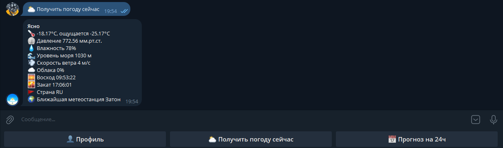

# 🌤️ Telegram Weather Bot

Простой, но функциональный Telegram-бот для получения актуальной информации о погоде в любом городе мира.

---

## 📸 Скриншоты




---

## 🚀 Возможности

- Узнать погоду через телеграм
- Автоматическая отправка погоды каждый час
- Данные: температура, влажность, давление, скорость ветра и тд

---

## 🛠 Технологии

- **Язык**: Python 3.12
- **Библиотеки**:
  - `telebot`
  - `requests`
  - `sqlite3`
  - `threading`
  - `datetime и time`
- **API погоды**: [OpenWeatherMap](https://openweathermap.org/api)

---

## 📦 Установка и запуск

1. **Клонируйте репозиторий:**
   ```bash
   git clone https://github.com/Levletsplay0/WeatherBot
   cd WeatherBot
2. **Установите зависимости:**
   ```bash
   pip install -r requirements.txt
3. **Добавьте токены OpenWeatherMap и TelegramBotApi в файл: .env**
      ```.env
    BOT_TOKEN=...
    WEATHER_TOKEN=...
